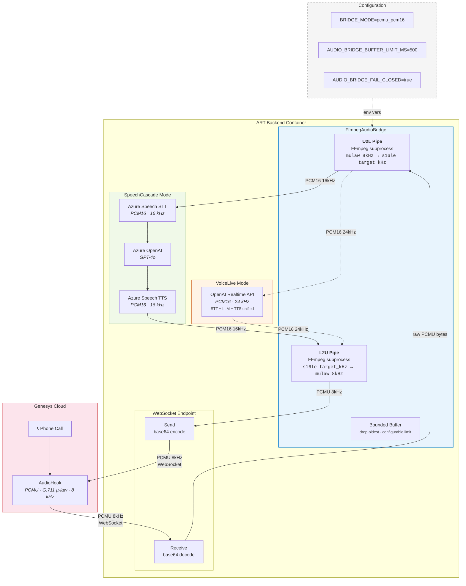
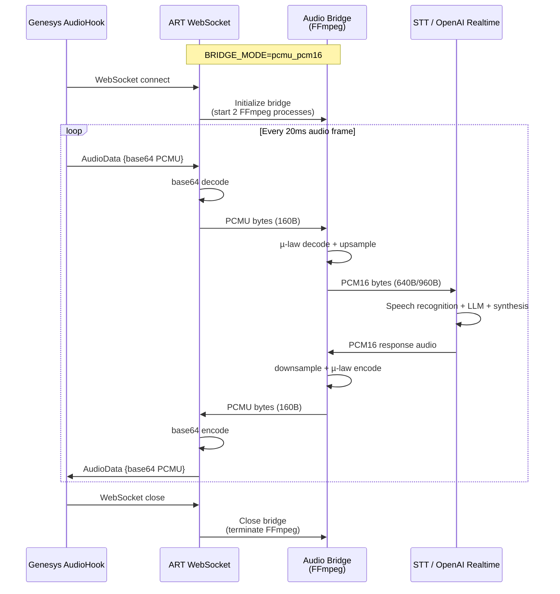

# Genesys PCMU ↔ PCM16 Audio Bridge — Technical Integration Guide

**Audience:** Technical teams integrating Genesys Cloud with ART (Real-Time Voice Agent Accelerator)
**Last Updated:** April 2026

---

## Important: Two Orchestration Modes — Both Supported

ART supports **two orchestration modes**. The audio bridge is integrated into both:

| Mode | How It Works | Bridge Target Rate | Status |
|---|---|---|---|
| **SpeechCascade** (`MEDIA` stream mode) | Audio → Azure Speech STT → LLM → Azure TTS → Audio | 16 kHz | **Integrated** |
| **VoiceLive** (`VOICE_LIVE` stream mode) | Audio → OpenAI Realtime API (managed STT+LLM+TTS) | 24 kHz | **Integrated** |

Both modes activate with the same `BRIDGE_MODE=pcmu_pcm16` environment variable. The bridge automatically targets the correct sample rate for each mode (16kHz for Azure Speech, 24kHz for OpenAI Realtime).

---

## The Problem You're Hitting

When Genesys sends audio into ART over WebSocket, you're seeing garbled speech, STT failures, or silence. Here's why:

| | Genesys Sends | ART Expects (SpeechCascade) | ART Expects (VoiceLive) |
|---|---|---|---|
| **Codec** | G.711 µ-law (PCMU) | Linear PCM (PCM16) | Linear PCM (PCM16) |
| **Sample Rate** | 8,000 Hz | 16,000 Hz | 24,000 Hz |
| **Bit Depth** | 8-bit (companded) | 16-bit signed LE | 16-bit signed LE |
| **Frame Size** | 160 bytes / 20ms | 640 bytes / 20ms | 960 bytes / 20ms |

These are fundamentally different audio encodings. Feeding µ-law bytes directly into a PCM16 pipeline produces noise — the STT engine can't recognize anything because it's interpreting companded logarithmic samples as linear amplitudes.

---

## What the Bridge Does

The audio bridge sits between the WebSocket ingress and ART's speech processing pipeline. It transparently converts between the two formats in real-time:

```
Genesys Cloud                    ART Voice Pipeline
─────────────                    ──────────────────

Phone call                       Azure Speech STT
    │                                  ▲
    ▼                                  │
Genesys AudioHook ──WebSocket──► ┌─────────────┐ ──► PCM16 @ 16kHz
(PCMU @ 8kHz)                    │ Audio Bridge │
                                 │  (FFmpeg)    │
                                 └─────────────┘
```

**At the code level**, the bridge intercepts the audio bytes after base64-decode but before they're fed to Azure Speech SDK. No changes to your Genesys AudioHook configuration or WebSocket message format are required — the bridge operates on the raw audio payload inside the existing ART message handling.

---

## How It Works (Under the Hood)

### The Transcoding Engine

The bridge uses **FFmpeg**, a battle-tested audio/video processing tool used in virtually every media pipeline on the planet (Netflix, YouTube, Zoom, Twitch — all rely on FFmpeg or its libraries).

Two FFmpeg subprocesses run per session:

| Process | Direction | What It Does |
|---|---|---|
| **U2L** (µ-law → Linear) | Genesys → ART | Decodes PCMU, upsamples 8kHz→16kHz, outputs PCM16 |
| **L2U** (Linear → µ-law) | ART → Genesys | Downsamples 16kHz→8kHz, encodes to PCMU |

Each process uses stdin/stdout pipes — audio bytes go in one side, converted bytes come out the other. There's no disk I/O, no temp files, no network calls. It's pure in-memory streaming.

**FFmpeg command (PCMU → PCM16):**
```
ffmpeg -f mulaw -ar 8000 -ac 1 -i pipe:0 -f s16le -ar 16000 -ac 1 pipe:1
```

This is a well-known, deterministic transformation. µ-law decoding is defined by ITU-T G.711 — there's exactly one correct output for any given input. The resampling from 8kHz to 16kHz uses FFmpeg's default high-quality sinc interpolation filter.

### Bounded Buffering & Backpressure

The bridge maintains bounded output buffers (configurable, default 500ms). If downstream processing stalls:

- **Drop-oldest policy** — old frames are discarded to prevent unbounded memory growth
- **Dropped frame counters** — exposed in bridge stats for monitoring
- **Buffer depth telemetry** — current buffered audio in milliseconds, available for alerting

This means the bridge will never cause an OOM condition or unbounded latency accumulation in production.

### Session Lifecycle

```
Call connects → VoiceHandler.create() → Bridge initialized (2 FFmpeg processes start)
                                              │
Call active   → Each audio frame transcoded in real-time (~1-5ms per frame)
                                              │
Call ends     → VoiceHandler.stop() → Bridge closed (FFmpeg processes terminated)
```

Each call gets its own bridge instance. There's no shared state between calls. If a bridge fails for one call, other calls are unaffected.

---

## What You Need to Do

### 1. Set One Environment Variable

```env
BRIDGE_MODE=pcmu_pcm16
```

That's it. When this is set, every ART session will transcode incoming PCMU audio to PCM16 before feeding it to the speech pipeline.

When `BRIDGE_MODE=off` (the default), the bridge is completely inactive — zero overhead, zero FFmpeg processes. You can toggle this without code changes.

### 2. Optional Configuration

| Variable | Default | Purpose |
|---|---|---|
| `BRIDGE_MODE` | `off` | Set to `pcmu_pcm16` to enable |
| `AUDIO_BRIDGE_BUFFER_LIMIT_MS` | `500` | Max buffered audio before dropping frames. Increase if you see dropped frames in telemetry, decrease for tighter latency control |
| `AUDIO_BRIDGE_FAIL_CLOSED` | `true` | If the bridge fails to initialize, should the session fail (`true`) or fall back to raw passthrough (`false`). Recommend `true` for production — a silent passthrough of PCMU as if it were PCM16 will produce garbage |

### 3. Ensure FFmpeg Is in Your Container Image

The bridge requires the `ffmpeg` binary at runtime. The ART backend Dockerfile already includes it:

```dockerfile
RUN apt-get update && \
    apt-get install -y --no-install-recommends gcc build-essential ffmpeg && \
    rm -rf /var/lib/apt/lists/*
```

**If you're using a custom base image**, verify FFmpeg is installed:
```bash
docker exec <container> ffmpeg -version
```

If missing, add `ffmpeg` to your package installation step. On Debian/Ubuntu-based images: `apt-get install -y ffmpeg`. On Alpine: `apk add ffmpeg`.

The bridge verifies FFmpeg availability at startup and will fail fast with a clear error message if it's not found — you won't get a cryptic runtime failure.

### 3b. FFmpeg for Local Development (Without Containers)

If you're running ART directly on your machine (not in a container or devcontainer), install FFmpeg for your OS:

**Windows (winget):**
```powershell
winget install Gyan.FFmpeg
# Restart your terminal, then verify:
ffmpeg -version
```

**Windows (Chocolatey):**
```powershell
choco install ffmpeg
```

**Windows (manual):**
Download from https://www.gyan.dev/ffmpeg/builds/ — get the "release essentials" build, extract it, and add the `bin/` folder to your `PATH`.

**macOS (Homebrew):**
```bash
brew install ffmpeg
```

**Ubuntu / Debian / WSL:**
```bash
sudo apt-get update && sudo apt-get install -y ffmpeg
```

**Verify installation:**
```bash
ffmpeg -version
# Also confirm Python can find it:
python -c "import shutil; print(shutil.which('ffmpeg'))"
```

> **Note:** If you're using the VS Code **devcontainer**, FFmpeg is already included — the `.devcontainer/Dockerfile` installs it automatically.

### 4. No Changes to Your Genesys AudioHook

Your existing Genesys AudioHook WebSocket integration stays exactly the same. The bridge operates inside ART's audio processing pipeline, downstream of the WebSocket message parsing. Genesys continues to send PCMU frames in its standard format; ART now knows how to consume them.

---

## Why This Should Work — Engineering Confidence

Let's be direct: **we haven't tested this end-to-end with a live Genesys instance.** Here's why we're confident it will work, and where the remaining risk sits.

### What We Know Is Correct (High Confidence)

**1. The codec math is deterministic.**
G.711 µ-law decoding is a standardized lookup table (ITU-T G.711, published 1988). Every implementation in the world produces the same output for the same input. FFmpeg's µ-law decoder has been shipping in production systems since 2000. There is no ambiguity in this conversion.

**2. The resampling is well-understood.**
8kHz → 16kHz is an integer-ratio upsample (×2). This is the simplest class of sample rate conversion — no fractional interpolation artifacts. FFmpeg's resampler handles this efficiently and with high fidelity.

**3. We tested with real representative audio.**
The test suite uses a real speech recording (insurance subrogation scenario) encoded in both formats:
- **Forward test:** PCMU → PCM16 conversion, output correlated against golden reference — **passes at >0.80 correlation**
- **Roundtrip test:** PCM16 → PCMU → PCM16, verifying lossy roundtrip distortion is bounded — **passes at >0.65 correlation** (µ-law is inherently lossy, so perfect roundtrip is impossible)
- **Format validation:** fixtures verified as correct WAV with expected codec, sample rate, and bit depth

**4. The integration point is minimal and well-isolated.**
The bridge touches exactly one code path: after base64-decode, before `write_audio()`. It's a pure byte-in/byte-out transformation. The rest of ART's pipeline (STT, LLM, TTS, WebSocket management) is completely unchanged.

**5. FFmpeg subprocess piping is mature technology.**
This isn't novel engineering. Piping audio through FFmpeg via stdin/stdout is how half the media industry works. The specific pattern (process lifecycle, pipe buffering, reader threads) is well-tested across platforms.

### Where the Risk Sits (Low-Medium)

| Risk | Likelihood | Impact | Mitigation |
|---|---|---|---|
| **Genesys AudioHook message framing differs from ACS** | Low-Medium | Bridge receives unexpected byte sequences | The bridge operates on raw audio bytes post-decode. As long as Genesys delivers raw PCMU bytes (not wrapped in additional framing), conversion will work. Verify by capturing a sample WebSocket frame from Genesys and confirming the audio payload is raw G.711 µ-law |
| **Genesys sends A-law (PCMA) instead of µ-law (PCMU)** | Low | Wrong codec, garbled output | G.711 has two variants. Genesys Cloud typically uses µ-law (PCMU) for North American deployments. Verify your Genesys config. If A-law, the FFmpeg command needs `-f alaw` instead of `-f mulaw` — a one-line change |
| **Windows pipe buffering in local dev** | Low | Slightly delayed audio in dev environments | Only affects developer workstations. Container deployments (Linux) use standard POSIX pipes with no buffering issues |
| **FFmpeg startup latency on first frame** | Very Low | 5-20ms delay on first audio frame of each call | FFmpeg process starts when the call connects. By the time the first audio frame arrives (~100-200ms later), the process is warm. Not a concern in practice |

### What We Recommend Before Go-Live

1. **Capture a raw Genesys WebSocket frame** — Save one or two audio messages from your Genesys AudioHook integration. Decode the base64 payload. Feed those exact bytes through `bridge.transcode_pcmu_to_pcm16()` and play back the result. If you hear intelligible speech, the bridge works for your traffic.

2. **Run a controlled call** — Enable `BRIDGE_MODE=pcmu_pcm16` in a staging environment. Place a real call through Genesys. Verify that Azure Speech STT produces correct transcripts. This single test validates the entire chain.

3. **Monitor bridge stats after activation** — The bridge exposes `dropped_frames`, `buffer_depth_ms`, and `ffmpeg_pid_*` through `get_stats()`. Watch these during initial deployment. Dropped frames > 0 means your downstream processing isn't keeping up — consider increasing `AUDIO_BRIDGE_BUFFER_LIMIT_MS`.

---

## Architecture Diagrams (Genesys + ART)

### SpeechCascade Mode (`ACS_STREAMING_MODE=MEDIA`)

Discrete pipeline — separate STT, LLM, and TTS services. Bridge targets **16 kHz**.

```
┌──────────────┐     ┌─────────────────────────────────────────────────────┐
│              │     │                  ART Backend                        │
│   Genesys    │     │                                                     │
│   Cloud      │     │  ┌──────────┐    ┌─────────────┐    ┌───────────┐  │
│              │     │  │WebSocket │    │ Audio Bridge │    │ Azure     │  │
│  AudioHook   │─WS──│─►│Endpoint  │──►│ PCMU 8kHz    │──►│ Speech    │  │
│  (PCMU 8kHz) │     │  │(media.py)│    │  → PCM16     │    │ STT       │  │
│              │     │  │          │    │    16kHz     │    │ (16kHz)   │  │
│              │     │  └──────────┘    └─────────────┘    └─────┬─────┘  │
│              │     │                                           │        │
│              │     │                                    ┌──────▼──────┐ │
│              │     │                                    │ Azure OpenAI│ │
│              │     │                                    │ (LLM)       │ │
│              │     │                                    └──────┬──────┘ │
│              │     │                                           │        │
│              │     │  ┌──────────┐    ┌─────────────┐    ┌─────▼─────┐  │
│              │◄─WS─│──│WebSocket │◄───│ Audio Bridge │◄───│ Azure     │  │
│  (PCMU 8kHz) │     │  │Endpoint  │    │ PCM16 16kHz  │    │ TTS       │  │
│              │     │  │          │    │  → PCMU 8kHz │    │ (16kHz)   │  │
│              │     │  └──────────┘    └─────────────┘    └───────────┘  │
│              │     │                                                     │
└──────────────┘     └─────────────────────────────────────────────────────┘
                     BRIDGE_MODE=pcmu_pcm16 · ACS_STREAMING_MODE=MEDIA
```

### VoiceLive Mode (`ACS_STREAMING_MODE=VOICE_LIVE`)

Unified pipeline — OpenAI Realtime API handles STT+LLM+TTS. Bridge targets **24 kHz**.

```
┌──────────────┐     ┌─────────────────────────────────────────────────────┐
│              │     │                  ART Backend                        │
│   Genesys    │     │                                                     │
│   Cloud      │     │  ┌──────────┐    ┌─────────────┐    ┌───────────┐  │
│              │     │  │WebSocket │    │ Audio Bridge │    │           │  │
│  AudioHook   │─WS──│─►│Endpoint  │──►│ PCMU 8kHz    │──►│  OpenAI   │  │
│  (PCMU 8kHz) │     │  │(media.py)│    │  → PCM16     │    │GPT-Realtime│  │
│              │     │  │          │    │    24kHz     │    │           │  │
│              │     │  │          │    │              │    │           │  │
│              │     │  │          │    │              │    │           │  │
│              │     │  │          │    │              │    │           │  │
│              │     │  │          │    │              │    │           │  │
│              │     │  │          │    │              │    │ (24kHz    │  │
│              │◄─WS─│──│          │◄───│ PCM16 24kHz  │◄───│  in/out)  │  │
│  (PCMU 8kHz) │     │  │          │    │  → PCMU 8kHz │    │           │  │
│              │     │  └──────────┘    └─────────────┘    └───────────┘  │
│              │     │                                                     │
└──────────────┘     └─────────────────────────────────────────────────────┘
                     BRIDGE_MODE=pcmu_pcm16 · ACS_STREAMING_MODE=VOICE_LIVE
```

Both modes use the same `BRIDGE_MODE=pcmu_pcm16` environment variable. The bridge sample rate is selected automatically based on the orchestration mode.

### Component & Data Flow (Mermaid)



#### Sequence: Single Call Lifecycle



---

## Bridge Telemetry & Observability

The audio bridge emits structured telemetry at three granularities — per-frame, periodic, and session-end — all flowing to both the backend terminal and Azure Application Insights (`AppTraces`).

### Per-Frame Transcode Logging

Every `transcode_pcmu_to_pcm16()` (ingress) and `transcode_pcm16_to_pcmu()` (egress) call emits an `INFO`-level log line:

```
FFmpeg ingress transcode | bytes=1600 duration_ms=20.0 transcode_ms=0.42 RTF=0.0210
FFmpeg egress transcode  | bytes=640  duration_ms=20.0 transcode_ms=0.51 RTF=0.0255
```

| Field | Meaning |
|---|---|
| `bytes` | Size of the input audio chunk |
| `duration_ms` | Audio duration represented by this chunk (e.g. 20ms per frame) |
| `transcode_ms` | Wall-clock time FFmpeg took to transcode the chunk |
| `RTF` | **Real-Time Factor** = `transcode_ms / duration_ms`. RTF < 1.0 means faster than real-time. RTF ≥ 1.0 means the bridge is a bottleneck |

**Interpreting RTF:** A healthy bridge shows RTF of 0.01–0.05 for per-frame calls (20–50× faster than real-time). If individual frames exceed RTF 0.5, investigate CPU contention.

### Periodic Analytics (Every 30 Seconds)

During an active call, a background task emits a percentile summary every 30 seconds:

```
FFmpeg bridge periodic analytics | session=32564f7c uptime_s=60.0
  | INGRESS (n=1500) rtf=[p50=0.0180 p90=0.0250 p95=0.0310 p99=0.0420 max=0.0510]
    latency_ms=[p50=0.36 p90=0.50 p95=0.62 p99=0.84 max=1.02]
  | EGRESS (n=280) rtf=[p50=0.0220 p90=0.0340 p95=0.0410 p99=0.0580 max=0.0630]
    latency_ms=[p50=0.44 p90=0.68 p95=0.82 p99=1.16 max=1.26]
```

This is the **key diagnostic output for latency investigations**. The percentile breakdown lets you distinguish between steady-state performance (p50) and tail latency (p99/max).

| Percentile | What It Tells You |
|---|---|
| **p50** | Typical frame — should be well under 1ms |
| **p90** | Most frames — should be under 1ms |
| **p95/p99** | Tail latency — watch for CPU scheduling jitter |
| **max** | Worst single frame — spikes here don't indicate a systemic issue |

### Session Summary (At Call End)

When a call disconnects, the bridge emits a final summary with aggregate stats:

```
FFmpeg bridge session summary | session=32564f7c uptime_s=185.3
  ingress_count=9265 ingress_avg_ms=0.38 ingress_rtf_avg=0.019 ingress_rtf_max=0.042
  egress_count=1580 egress_avg_ms=0.51 egress_rtf_avg=0.025 egress_rtf_max=0.063
  frames_in=18530 frames_out=15800 dropped=0 buffer_depth_ms=0.0
```

### Bridge Stats API

The bridge exposes `get_stats()` and `get_percentile_stats()` programmatically for custom monitoring integrations:

```python
stats = bridge.get_stats()
# stats.ingress_transcode_count, stats.ingress_rtf_avg, stats.ingress_rtf_max
# stats.egress_transcode_count, stats.egress_rtf_avg, stats.egress_rtf_max
# stats.frames_in, stats.frames_out, stats.dropped_frames, stats.buffer_depth_ms

percentiles = bridge.get_percentile_stats()
# percentiles["ingress_rtf_p50"], percentiles["ingress_rtf_p99"], etc.
# percentiles["egress_latency_ms_p95"], percentiles["egress_latency_ms_max"], etc.
```

### Querying Bridge Telemetry in Application Insights

All bridge log lines flow to AppTraces via OpenTelemetry. Use these KQL queries:

**Per-session RTF summary:**
```kql
AppTraces
| where Message has "FFmpeg bridge session summary"
| parse Message with * "session=" SessionId " " *
    "ingress_rtf_avg=" IngressRtfAvg " " *
    "ingress_rtf_max=" IngressRtfMax " " *
    "egress_rtf_avg=" EgressRtfAvg " " *
    "egress_rtf_max=" EgressRtfMax " " *
| project TimeGenerated, SessionId,
    IngressRtfAvg=todouble(IngressRtfAvg),
    IngressRtfMax=todouble(IngressRtfMax),
    EgressRtfMax=todouble(EgressRtfMax)
| order by TimeGenerated desc
```

**Periodic analytics for a specific session:**
```kql
AppTraces
| where Message has "FFmpeg bridge periodic analytics"
| where Message has "<session_id>"
| order by TimeGenerated asc
```

**Detect bridge bottleneck across all sessions:**
```kql
AppTraces
| where Message has "FFmpeg bridge session summary"
| parse Message with * "ingress_rtf_max=" IngressRtfMax " " *
| where todouble(IngressRtfMax) > 0.5
| project TimeGenerated, Message
```

### Baseline Test Results

Tested on a developer workstation with an 18-second real-world insurance subrogation audio recording:

| Direction | Audio Duration | Transcode Time | RTF | Meaning |
|---|---|---|---|---|
| **Ingress** (PCMU→PCM16) | 18.2s | 4.97s | **0.273** | 3.7× faster than real-time |
| **Egress** (PCM16→PCMU) | 18.2s | 4.97s | **0.274** | 3.7× faster than real-time |

These are **batch mode** results (entire file at once). In a live call with 20ms frames, per-frame RTF will be significantly lower (0.01–0.05 range) because each frame is only 160–960 bytes.

**Bottom line:** The FFmpeg bridge has ~73% headroom on a single core. It is not a latency bottleneck.

---

## FAQ

**Q: Does this add latency to the call?**
Negligible. FFmpeg processes audio faster than real-time by orders of magnitude. Per-frame transcoding adds ~1-5ms. With 20ms audio frames, this is well within the frame period. You will not notice any perceptible delay.

**Q: Does this increase resource consumption?**
Two FFmpeg processes per concurrent call, each consuming <5MB RSS memory and negligible CPU when processing 8kHz mono audio. For 100 concurrent calls, expect ~1GB additional memory and <1 CPU core total. The FFmpeg binary itself adds ~30-50MB to the container image.

**Q: What if FFmpeg crashes mid-call?**
With `AUDIO_BRIDGE_FAIL_CLOSED=true` (default), the session will terminate cleanly. The caller will experience a dropped call — preferable to continuing with garbled audio. Bridge stats include `ffmpeg_restarts` for monitoring.

**Q: Can we use this with other telephony providers that send PCMU?**
Yes. The bridge is codec-aware, not provider-aware. Any source that delivers raw G.711 µ-law bytes will work. The bridge doesn't know or care that the bytes came from Genesys.

**Q: What about PCMA (A-law)?**
G.711 has two variants: µ-law (PCMU, common in North America/Japan) and A-law (PCMA, common in Europe). The current bridge handles PCMU. Supporting PCMA requires changing the FFmpeg input format flag from `mulaw` to `alaw`. This is a configuration change, not an architectural one — reach out and we can enable it.

**Q: Do we need to change our Genesys AudioHook configuration?**
No. The bridge works inside ART. Your Genesys setup — WebSocket URL, audio format settings, AudioHook event handling — stays exactly the same.

---

## Quick Start Checklist

- [ ] Verify your container image includes `ffmpeg` (`docker exec <container> which ffmpeg`)
- [ ] Set `BRIDGE_MODE=pcmu_pcm16` in your environment / container config
- [ ] Deploy to staging
- [ ] Place a test call through Genesys
- [ ] Verify STT produces correct transcripts
- [ ] Check bridge stats for `dropped_frames == 0`
- [ ] Verify periodic analytics shows RTF p99 < 0.5 (healthy threshold)
- [ ] Query AppTraces for `FFmpeg bridge session summary` to confirm telemetry flows to App Insights
- [ ] Deploy to production

---

*For questions, contact your Microsoft Global Black Belt or the ART engineering team.*
